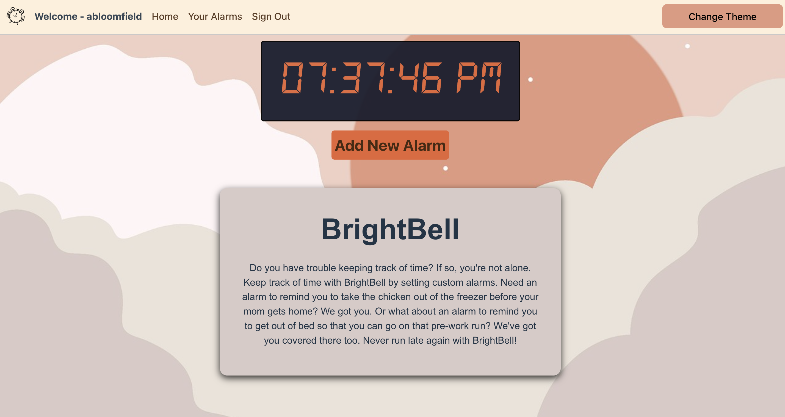
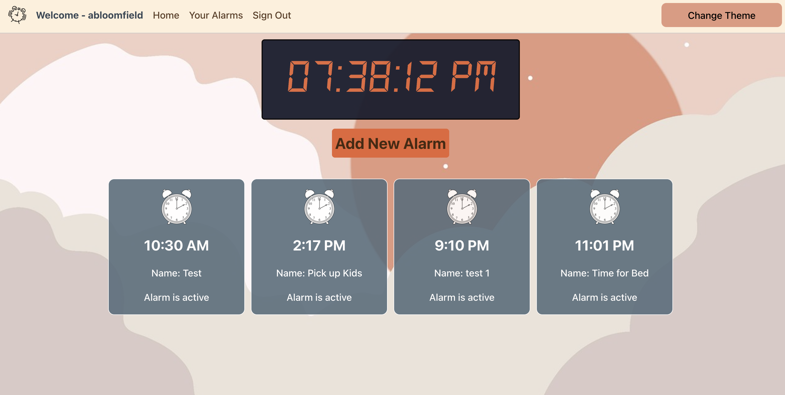

# BrightBell

## Introduction

BrightBell is a full stack alarm app that allows users to create custom alarms to ensure that they are on time for whatever life throws at them. Users can choose from a curated list of tones and label their alarms as they see fit.

## Live Demo

Check out Alarm Mate [here](https://alarmmate.netlify.app/).

## Planning Materials

For the planning of Alarm Mate, we created an ERD chart, wireframes, a routing chart and user stories. Planning materials can be found here on [Trello](https://trello.com/b/A0aIpfsD/alarm-application)

## App Features

- User authentication - token based authentication provides users with secure sign-in and sign-out functionality
- Personalized alarms - users create their own labels for their alarms. In addition to creating new alarms, users can also keep track of their current list of alarms, edit, or delete them
- Snooze - users can enable a snooze function whenever they need a little bit more time
- Themes - users can change the theme of their app based on their preference for a light or dark mode
- Live Timekeeping - a clock widget is present on every page of the app when the user is logged in

## Front-End Technologies Used

- React
- CSS
- Javscript

## Back-End Repo

Here is the githbub link to the back end:
[Back-end Repo](https://github.com/abl00mfield/alarm-app-back-end)

## Resources Used

- Images: [Pixabay](https://pixabay.com/)
- Favicon: [Flaticon](https://www.flaticon.com/free-icons/clock)
- Font: [Dafont](dafont.com)
- Tones: [MixKit](https://mixkit.co/free-sound-effects/alarm/)

## Next Steps

Stretch goals for Alarm Mate include:

- Ability to upload custom tones or songs snippets

## Authors

- Amanda Bloomfield
- Celisa Walker
- Joana Allen
